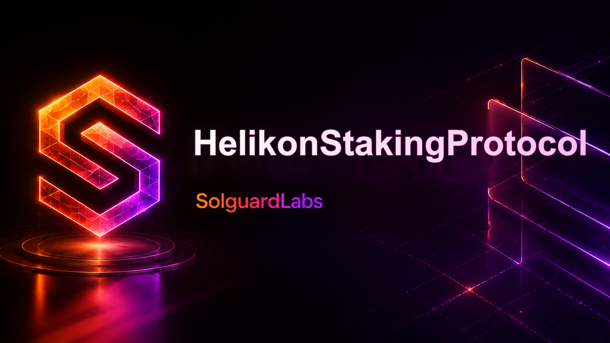

# Helikon Staking Protocol



Helikon is a Vyper staking protocol for ERC-20 assets with epoch rewards, temporary boost tiers, and early exit penalties. The protocol separates custody, boost policy, reward emission, reserve accounting, lens reads, and operational monitoring into independent modules.

## Architecture

```text
HelikonAccess       roles, pauses, and operational authorities
BoostTierRegistry  boost multipliers, durations, renewal delays, and fees
EpochRewarder      epoch budgets, reward index, funding, and payouts
HelikonStakingVault principal custody, positions, boosts, claims, exits
PenaltyReserve     penalty custody and treasury withdrawals
HelikonLens        frontend and indexer reads
HelikonMonitor     keeper-oriented health checks
HelikonToken       local ERC-20 implementation for tests and demos
```

## Requirements

- Python 3.11 or newer.
- Vyper 0.4.x.
- pytest.

```bash
python -m venv .venv
. .venv/bin/activate
python -m pip install -r requirements.txt
python scripts/compile_sources.py
python -m pytest -q
```

On Windows PowerShell:

```powershell
python -m venv .venv
.venv\Scripts\python.exe -m pip install -r requirements.txt
.venv\Scripts\python.exe scripts\compile_sources.py
.venv\Scripts\python.exe -m pytest -q
```

## Protocol Flow

1. Governance configures roles, reward epochs, and boost tiers.
2. Stakers deposit principal into `HelikonStakingVault`.
3. Epoch emissions update a global reward index using active accounting weight.
4. Stakers can activate temporary boosts with configured durations and fees.
5. Claims materialize pending rewards from `EpochRewarder`.
6. Early exits apply a time-based penalty credited to `PenaltyReserve`.
7. Keepers close epochs and monitor solvency through `HelikonMonitor`.

## Layout

```text
src/                  Vyper protocol modules and public interfaces
tests/                Python behavior tests
scripts/              compile, test, and CI entrypoints
.github/workflows/    GitHub Actions workflow
.vscode/              editor tasks and recommendations
```

## Security

See `SECURITY.md` for review scope, invariants, dependency policy, and reporting process.
