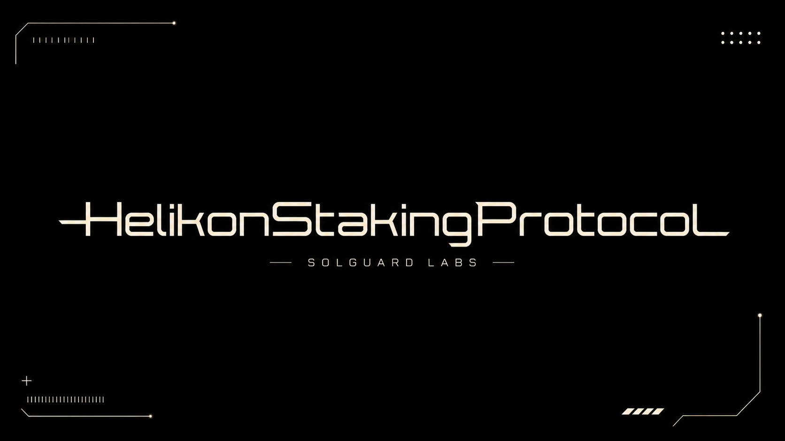
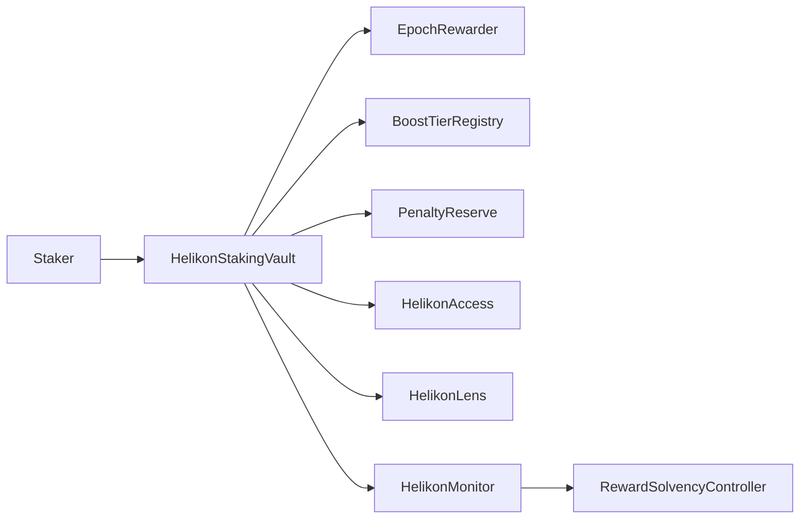
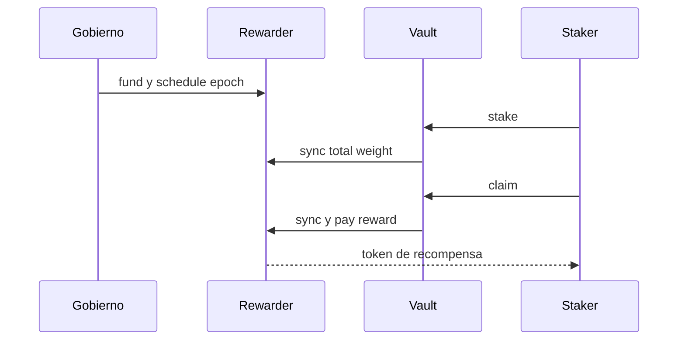
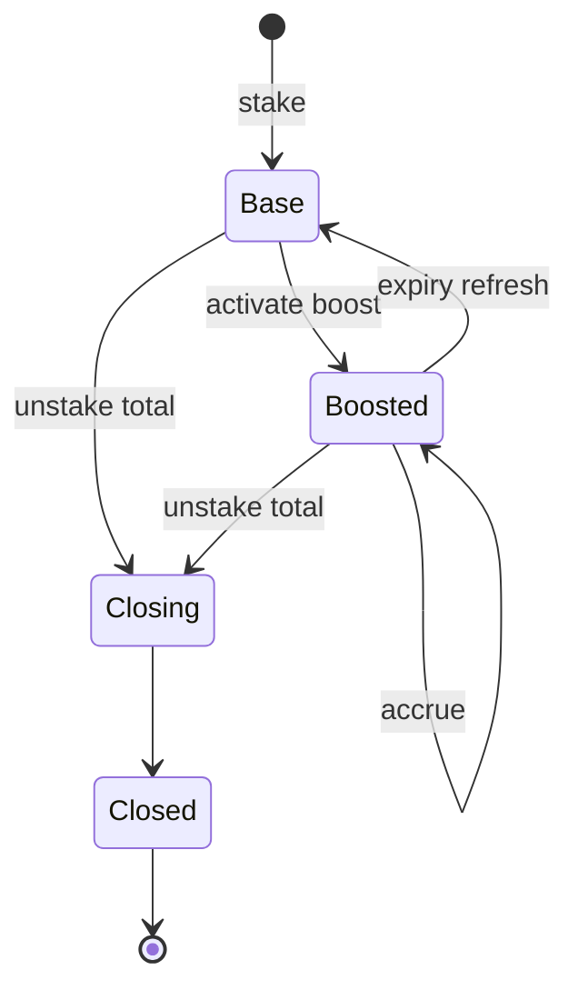
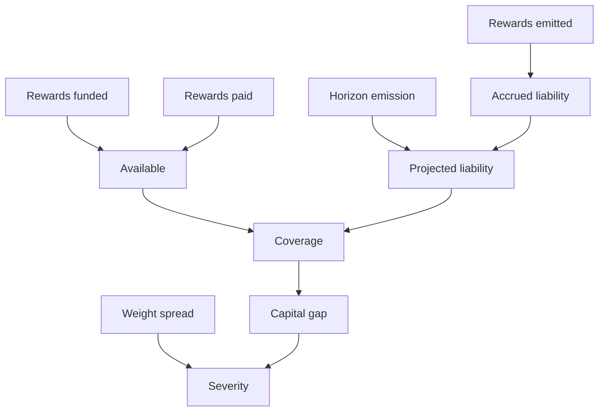

# Helikon Staking Protocol

Helikon es un protocolo modular de staking en Vyper para activos ERC-20. Separa custodia de principal, emisión por épocas, niveles de boost temporales, penalizaciones de salida, observabilidad y política de solvencia. Un SDK Python reproduce las métricas críticas con aritmética entera.

## Componentes


```mermaid
flowchart LR
    U["Staker"] --> V["HelikonStakingVault"]
    V --> R["EpochRewarder"]
    V --> B["BoostTierRegistry"]
    V --> P["PenaltyReserve"]
    V --> A["HelikonAccess"]
    V --> L["HelikonLens"]
    V --> M["HelikonMonitor"]
    M --> S["RewardSolvencyController"]
```

| Módulo | Función |
| --- | --- |
| `HelikonStakingVault` | principal, posiciones, peso y salidas |
| `EpochRewarder` | presupuestos, índice global y pagos |
| `BoostTierRegistry` | multiplicadores, duración, tarifa y renovación |
| `PenaltyReserve` | custodia y conciliación de penalizaciones |
| `HelikonAccess` | roles, pausa y relevo administrativo |
| `HelikonLens` | lecturas agregadas para clientes |
| `HelikonMonitor` | señales de salud para operadores |
| `RewardSolvencyController` | cobertura, concentración y déficit proyectado |

## Economía de recompensas

```text
w_i = principal_i × multiplierBps_i / 10 000
I[t+1] = I[t] + emission[t] × 10²⁷ / totalWeight[t]
reward_i = w_i × (I[now] - I[paid]) / 10²⁷
```

Las épocas fijan presupuesto, tasa y duración. El índice distribuye únicamente la emisión transcurrida y queda acotado por el presupuesto disponible.


```mermaid
sequenceDiagram
    participant G as Gobierno
    participant R as Rewarder
    participant V as Vault
    participant U as Staker
    G->>R: fund y schedule epoch
    U->>V: stake
    V->>R: sync total weight
    U->>V: claim
    V->>R: sync y pay reward
    R-->>U: token de recompensa
```

## Boost temporal

Un nivel define multiplicador, principal mínimo y máximo, duración, espera de renovación, tarifa y penalización. La activación materializa primero el índice y después sustituye el peso de la posición.


```mermaid
stateDiagram-v2
    [*] --> Base: stake
    Base --> Boosted: activate boost
    Boosted --> Base: expiry refresh
    Boosted --> Boosted: accrue
    Base --> Closing: unstake total
    Boosted --> Closing: unstake total
    Closing --> Closed
    Closed --> [*]
```

## Solvencia proyectada

El controlador suma obligación devengada y emisión del horizonte, la compara con recompensas financiadas aún disponibles y calcula concentración de peso:

```text
available = funded - paid
accrued = max(emitted - paid, 0)
projected = accrued + horizonEmission
coverageBps = available × 10 000 / projected
capitalGap = max(projected - available, 0)
spreadBps = max(accountingWeight - baseWeight, 0) × 10 000 / baseWeight
```


```mermaid
flowchart TD
    F["Rewards funded"] --> A["Available"]
    P["Rewards paid"] --> A
    E["Rewards emitted"] --> L["Accrued liability"]
    H["Horizon emission"] --> Q["Projected liability"]
    L --> Q
    A --> C["Coverage"]
    Q --> C
    C --> G["Capital gap"]
    W["Weight spread"] --> S["Severity"]
    G --> S
```

## Inicio rápido

Requisitos: Python 3.12 y Vyper 0.4.3.

```bash
python -m venv .venv
source .venv/bin/activate
python -m pip install -r requirements.txt
python scripts/compile_sources.py
python -m pytest -q
python scripts/verify_release.py
```

En PowerShell, activa el entorno con `.venv\Scripts\Activate.ps1`.

## SDK Python

```python
from sdk.helikon import RewardSnapshot, assess_solvency

assessment = assess_solvency(RewardSnapshot(
    principal=1_000_000,
    base_weight=1_000_000,
    accounting_weight=1_200_000,
    rewards_funded=500_000,
    rewards_paid=100_000,
    rewards_emitted=250_000,
    horizon_emission=100_000,
))
print(assessment.coverage_bps, assessment.severity)
```

## Calidad y publicación

`python scripts/ci.py` compila bytecode, valida sintaxis Python, ejecuta pruebas y comprueba integridad documental. GitHub repite la puerta en Ubuntu y Windows. `main`, `production` y la etiqueta anotada de una versión publicada deben identificar el mismo commit.

## Documentación

- [Arquitectura](docs/arquitectura.md)
- [Modelo de recompensas](docs/modelo-recompensas.md)
- [Boosts y posiciones](docs/boosts-y-posiciones.md)
- [Solvencia](docs/solvencia.md)
- [Operación](docs/operacion.md)
- [Integración](docs/integracion.md)
- [Gobernanza](docs/gobernanza.md)
- [Política de seguridad](SECURITY.md)

## Licencia

MIT. Consulta [LICENSE](LICENSE).
