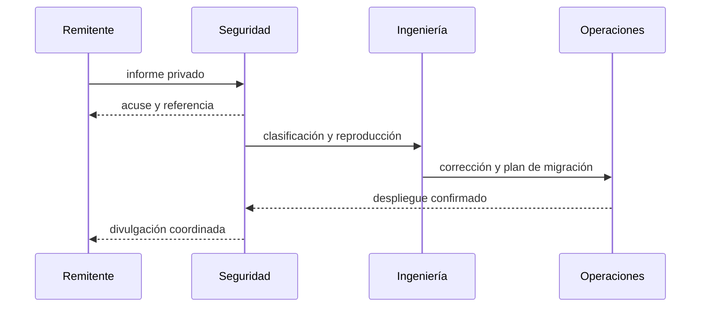

# Política de seguridad

## Versiones mantenidas

| Serie | Estado | Rama |
| --- | --- | --- |
| 1.0.x | Mantenida | `production` |
| anteriores | Sin mantenimiento | — |

## Comunicación responsable

Envía cualquier hallazgo mediante **Security → Report a security issue** en GitHub. No publiques detalles técnicos sensibles en incidencias o discusiones. Incluye commit, contrato y función, precondiciones, impacto económico, reproducción mínima y propuesta de corrección.

Confirmaremos recepción en dos días laborables y entregaremos una clasificación inicial en cinco. La publicación coordinada ocurre después de distribuir una corrección y verificar la migración.

## Activos y límites

El perímetro incluye custodia de principal, pagos de recompensa, cálculo de peso e índice, niveles temporales, roles, pausas, reserva de penalizaciones, interfaces y automatización de publicación. Los integradores y la custodia de claves se evalúan por separado.

## Puerta de publicación

Se requiere coincidencia exacta entre `main`, `production` y el commit pelado de la etiqueta. Las cuentas administrativas usan separación de funciones, retraso de relevo y almacenamiento externo de claves.

## Respuesta operativa

Ante una señal confirmada, se detienen las entradas o boosts afectados, se preservan eventos, se calculan obligaciones por época y se publica un plan de restauración. Una pausa no autoriza alterar saldos históricos ni omitir la conciliación posterior.
