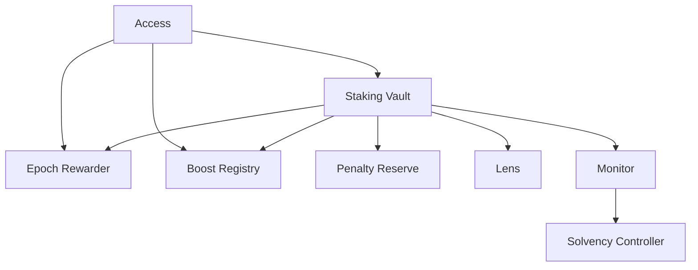
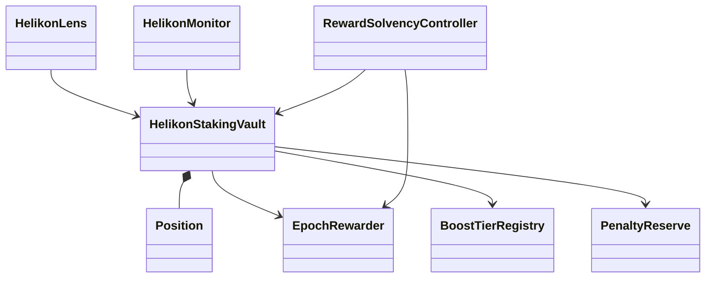
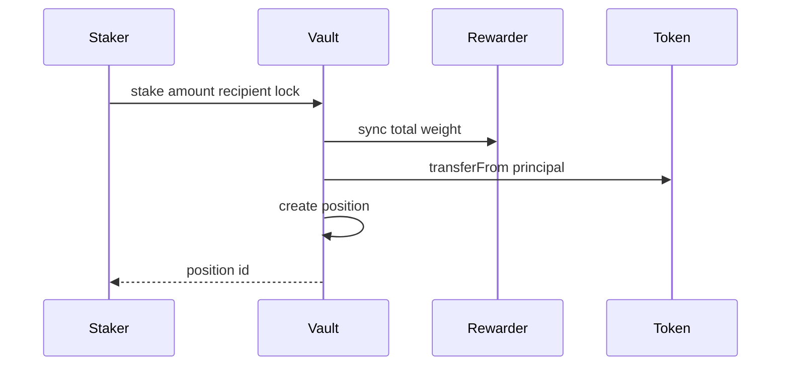

# Arquitectura

## Capas

Helikon distribuye autoridad entre contratos pequeños. El vault mantiene posiciones; el rewarder controla la emisión; el registro define boosts; la reserva custodia penalizaciones; acceso autoriza; lens y monitores sólo leen.

## Estado autorizado

`HelikonStakingVault` es la fuente de principal y peso. `EpochRewarder` es la fuente de presupuestos e índice. Ningún monitor puede transferir tokens o cambiar una posición.

## Apertura atómica

Primero se sincroniza el índice con el peso anterior; después se recibe el activo y se crea la posición con `reward_index_paid` igual al índice actual. Así, una entrada nueva no recibe emisión histórica.

## Dependencias

Las direcciones se fijan en despliegue y se rechaza la dirección cero. Los módulos de política se gobiernan por roles; las lecturas entre contratos son `staticcall`; las transferencias comprueban el valor booleano del ERC-20.

## Determinismo

Pesos, índices y penalizaciones usan enteros. La escala de peso es BPS y la del índice es RAY. Toda división redondea hacia abajo y el orden de actualización se documenta en [Modelo de recompensas](modelo-recompensas.md).
