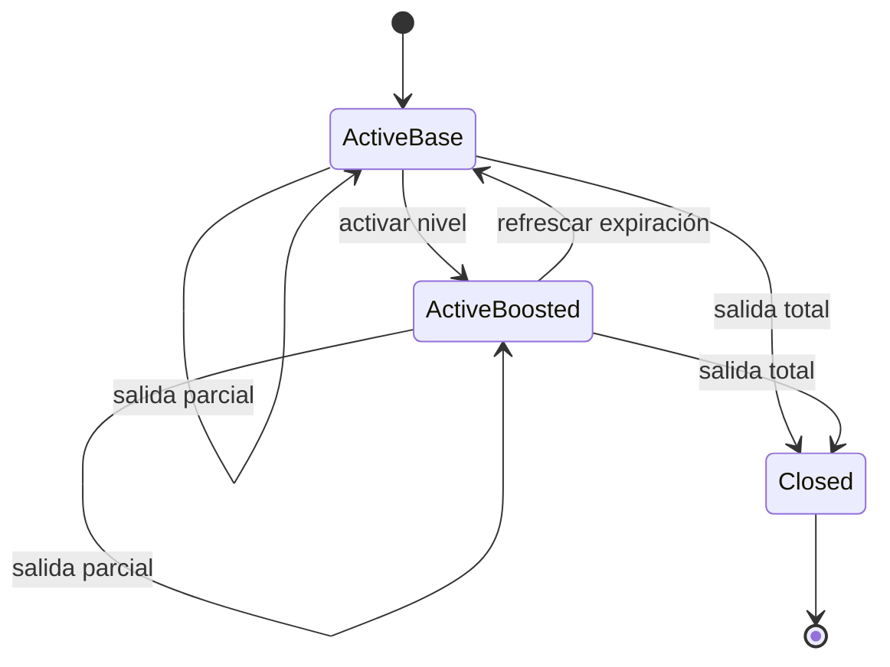
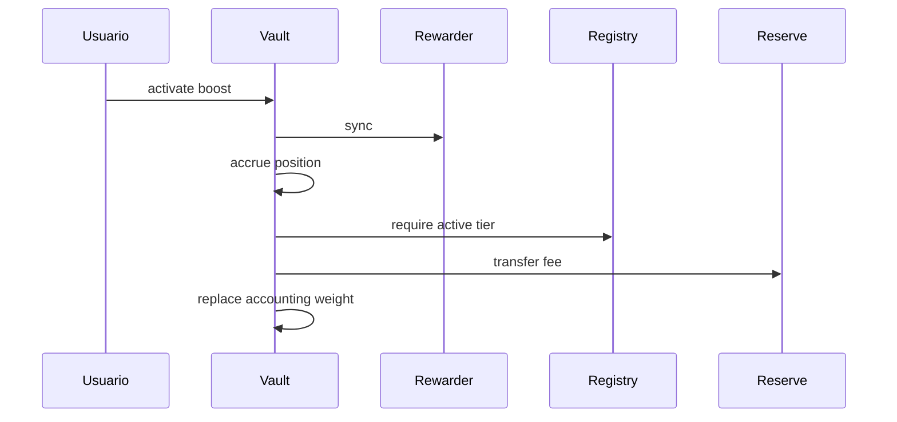
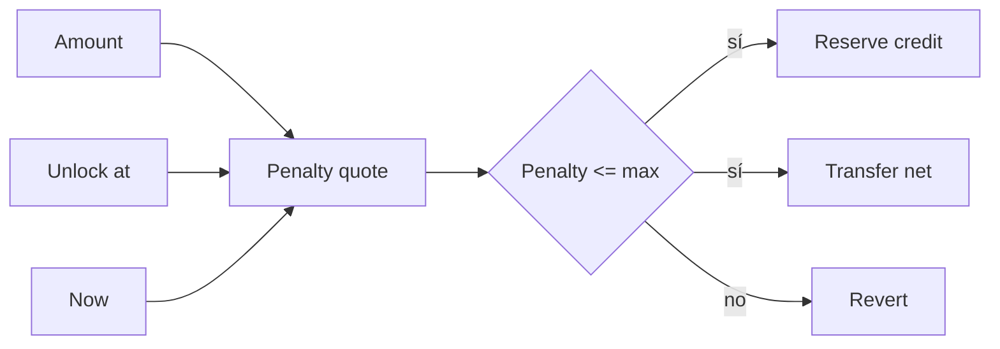

# Boosts y posiciones

## Posición

Una posición conserva propietario, principal, peso base, peso contable, multiplicador, nivel, ventanas temporales, índice pagado, recompensa pendiente y estado.



## Activación



La política comprueba principal mínimo y máximo, duración, espera desde el final anterior y tarifa. El peso nuevo reemplaza al anterior; no se suma como una posición adicional.

## Salida temprana

La penalización lineal depende del importe, tiempo restante y horizonte anual:

```text
penalty = amount × remaining / 365 days / 5
received = amount - penalty
```

El usuario suministra un máximo aceptable para protegerse de cambios temporales entre simulación y ejecución.



## Operadores

El propietario puede aprobar un operador global o uno por posición. La autorización no cambia la titularidad y puede revocarse. Los clientes deben mostrar siempre receptor e importe neto antes de firmar.
