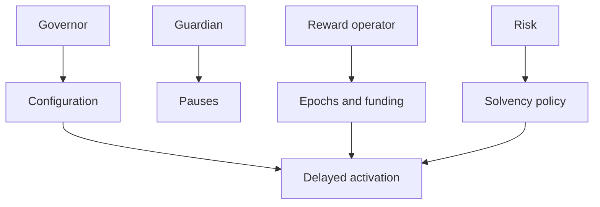
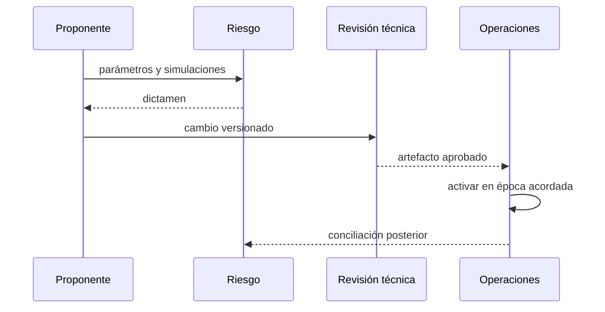
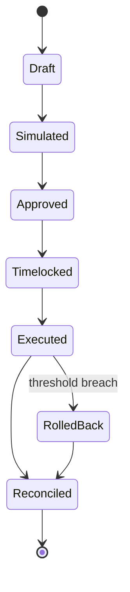

# Gobernanza

## Roles

La autoridad se divide entre gobierno, guardián, operador de recompensas y riesgo. El relevo administrativo usa una cuenta pendiente y aceptación explícita.

## Propuesta

Toda modificación incluye valor anterior y nuevo, unidad, contratos, hipótesis, escenarios de cobertura, época de activación y reversión.

## Cambios sensibles

- duración, tasa y presupuesto de época;
- multiplicador, tarifa y renovación de niveles;
- umbrales de cobertura y concentración;
- pausas, roles y direcciones de módulos;
- retirada de reservas y recuperación de activos.

## Emergencias

El guardián puede contener actividad dentro de sus permisos. La medida se documenta, caduca y recibe revisión posterior. No se cambian saldos ni se retira reserva como parte automática de una pausa.

## Evidencia

Se conserva propuesta, simulación, aprobaciones, commit, bytecode, resultado de automatización, transacción, bloque, eventos y conciliación. Las etiquetas publicadas son inmutables.
