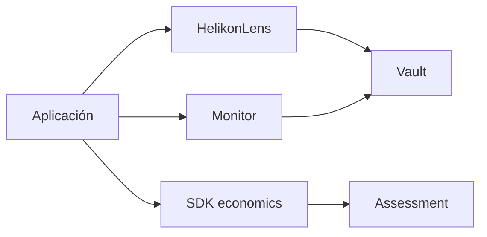
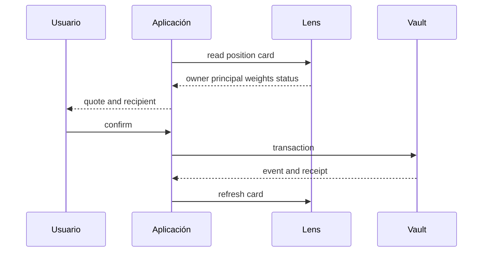
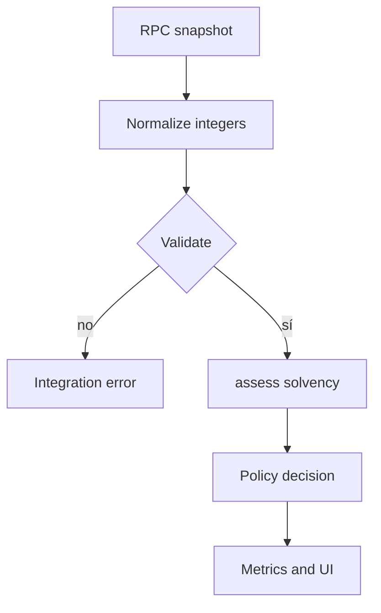

# Integración

## Lecturas

`HelikonLens` ofrece tarjetas de posición y protocolo. Los consumidores deben tratar números como enteros sin signo y aplicar decimales del token únicamente en presentación.

## Preparación de transacciones

No construyas una transacción desde datos cacheados. Vuelve a leer propietario, principal, desbloqueo, nivel y estado inmediatamente antes de firmar.

## SDK económico

Las dataclasses son inmutables y validan rango `uint256`, orden de cobertura y consistencia entre fondos y pagos. `assess_portfolio` agrega grupos sin mezclar sus parámetros.

## Eventos

Indexa apertura, activación, refresco, claim, retirada, financiación, programación y cierre de época. Una proyección local no sustituye al evento confirmado ni al estado del bloque finalizado.

## Reintentos

Las escrituras no se reenvían ciegamente. Ante un recibo ambiguo, consulta nonce, evento y estado antes de construir otra transacción. Los identificadores de posición deben tratarse como únicos en la red configurada.
