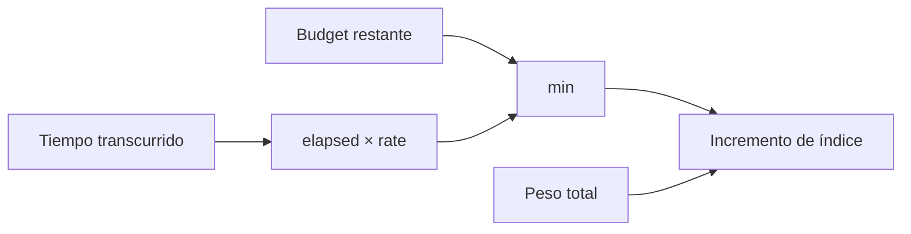
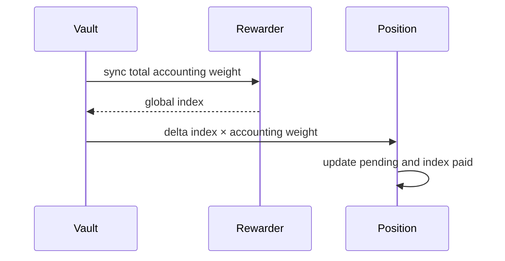
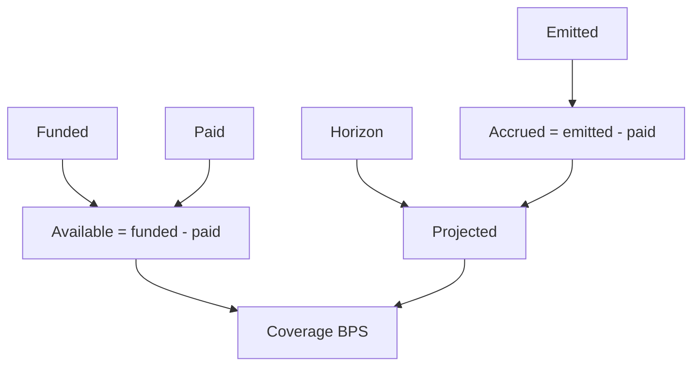

# Modelo de recompensas

## Emisión por época

Cada época contiene inicio, fin, presupuesto, tasa, emisión e índices extremos. La sincronización limita el tiempo al fin de época y la cantidad al presupuesto restante.



```text
emission = min(elapsed × rewardRate, budget - emitted)
deltaIndex = emission × RAY / observedWeight
globalIndex = globalIndex + deltaIndex
```

Si el peso observado es cero, se avanza el reloj sin distribuir. El presupuesto no atribuido permanece en el rewarder.

## Devengo individual



El pago sólo materializa `pending_reward`; el rewarder mantiene `funded`, `emitted` y `paid` para reconciliar disponibilidad y obligación.

## Conciliación



Un informe de cierre registra presupuesto, emisión, índice final, pagos, saldo del token y peso observado. Las sumas se realizan en unidades menores del token.

## Ejemplo

Con emisión `100` por segundo, peso total `2.500` y ventana `60` segundos, el incremento es `2,4 × RAY`. Una posición de peso `1.000` recibe `2.400` unidades; las diferencias por división permanecen en el contrato y no se redondean a favor del receptor.
