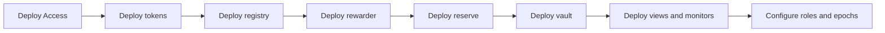
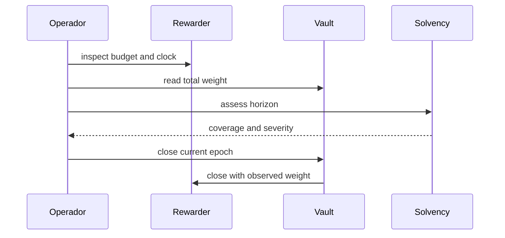
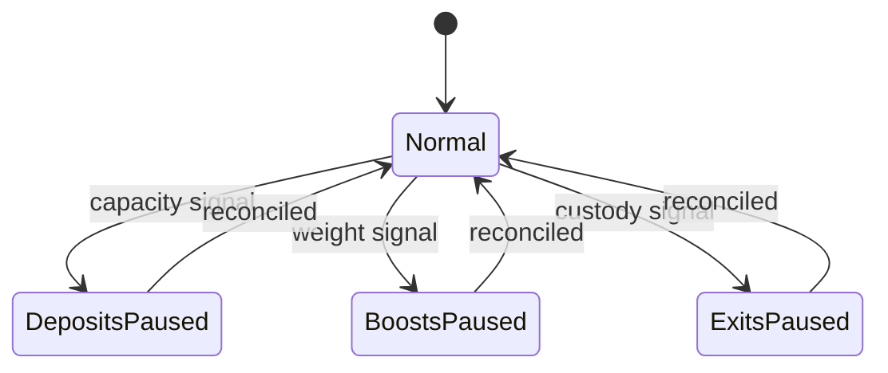

# Operación

## Arranque

Todas las direcciones, roles y parámetros se verifican antes de abrir depósitos. El rewarder debe estar financiado antes de programar una emisión.

## Rutina de época

Antes del cierre se comparan hora, presupuesto, emisión, peso, pagos y saldo. Después se archiva el índice final y se prepara la siguiente época.

## Pausas

Las pausas se aplican por función. Una señal de recompensas suele detener boosts y nuevas entradas antes que salidas; una señal de custodia puede requerir detener salidas mientras se confirma el saldo.

## Recuperación

Conserva eventos y bloque, calcula obligaciones por posición, compara tokens, reproduce el índice y documenta cualquier diferencia. La reanudación requiere doble revisión y una evaluación de solvencia normal o expresamente aceptada.
