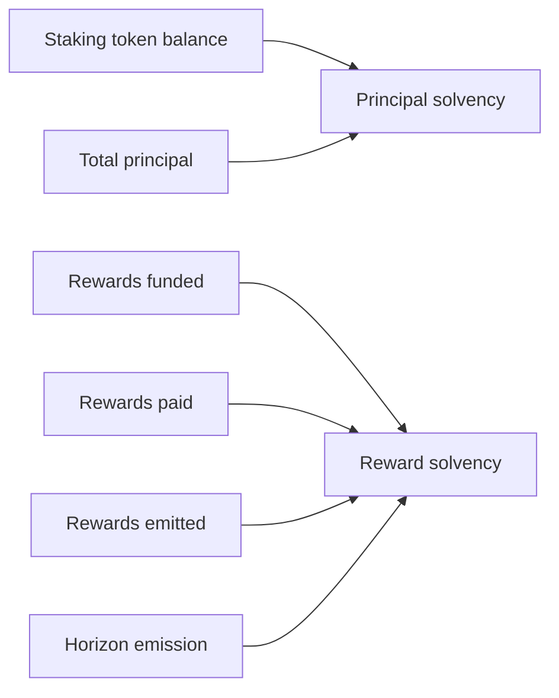
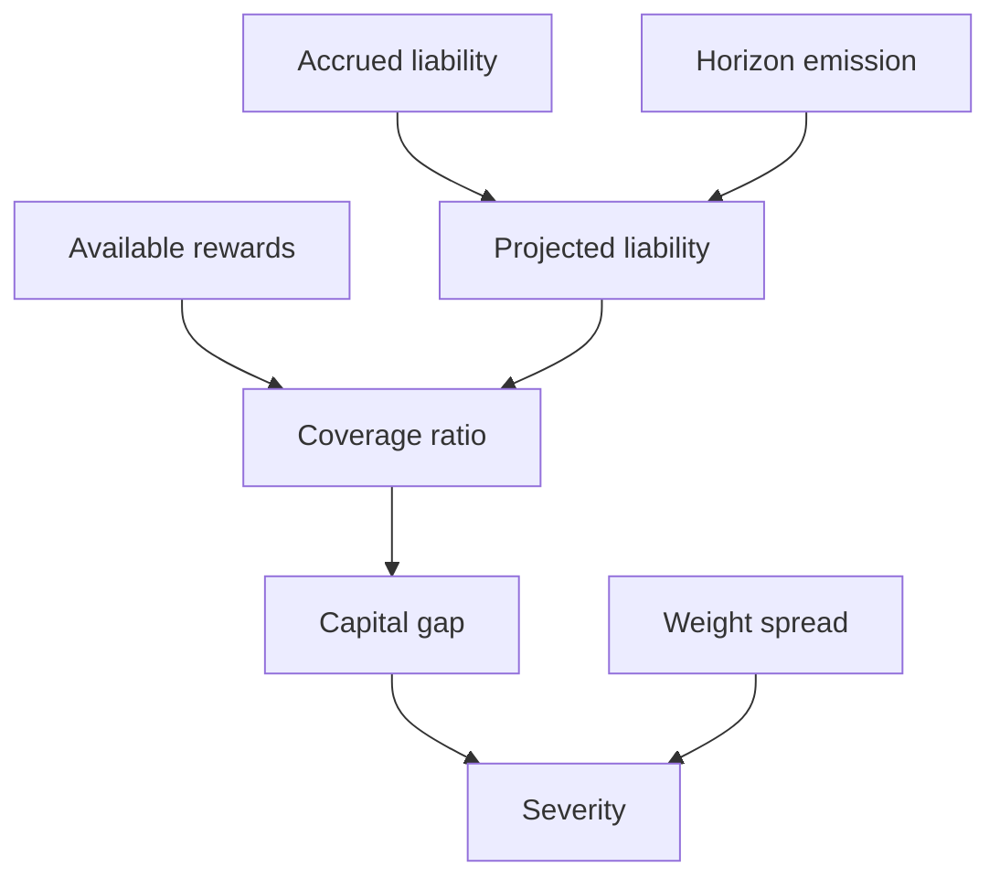
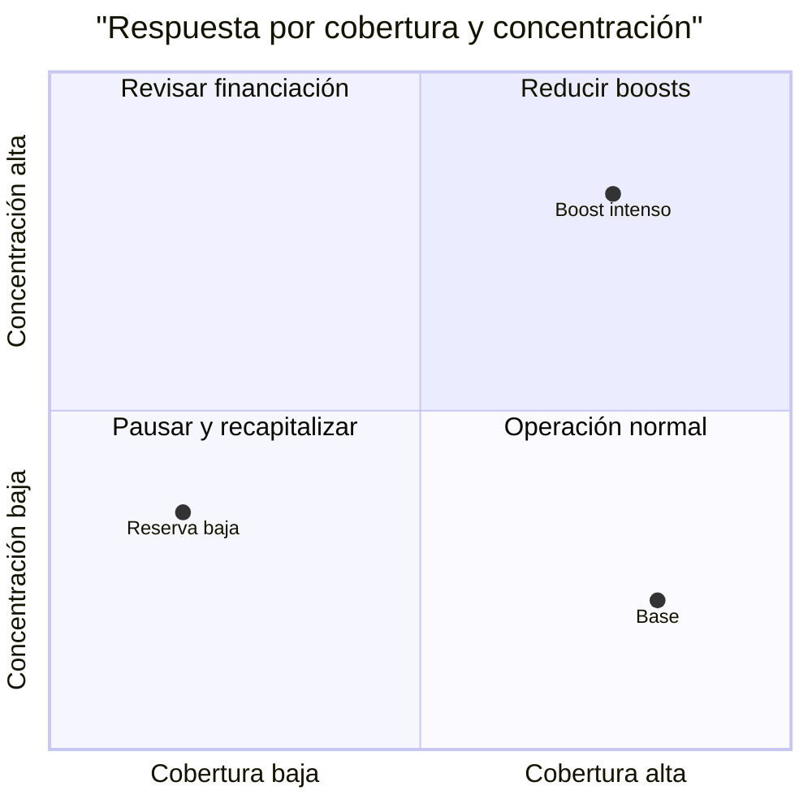

# Solvencia

## Dos reservas separadas

El principal de staking y el token de recompensa tienen obligaciones distintas. La solvencia de principal compara saldo del vault con principal total; la de recompensas compara fondos disponibles con emisión devengada y proyectada.

## Waterfall

El nivel es crítico ante principal no solvente, déficit de capital o cobertura inferior al umbral crítico. Es alto ante cobertura inferior al mínimo o concentración de peso superior al límite; una banda del 75 % genera estado vigilado.

## Escenarios

| Escenario | Entrada | Lectura esperada |
| --- | --- | --- |
| base | 160 % cobertura | normal |
| concentración | spread 60 % | alto |
| agotamiento | fondos menores que obligación | crítico |
| principal | saldo inferior a depósitos | crítico |
| sin obligación | horizonte cero | cobertura no acotada |

## Uso

El controlador es observacional y registra la última evaluación. La política operativa decide pausas o financiación; el controlador no transfiere activos ni altera pesos.
